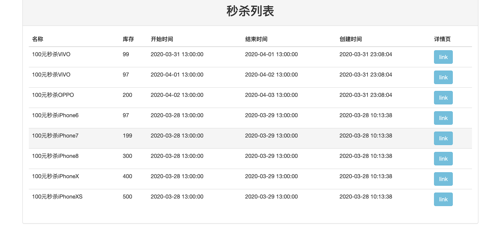
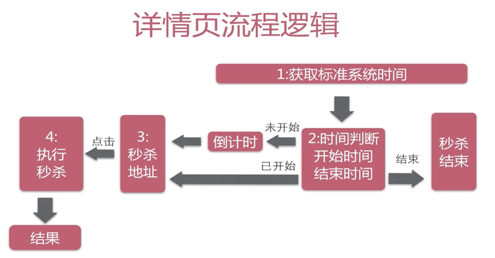
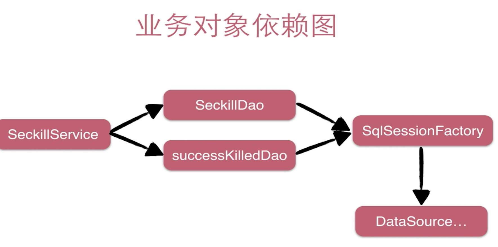
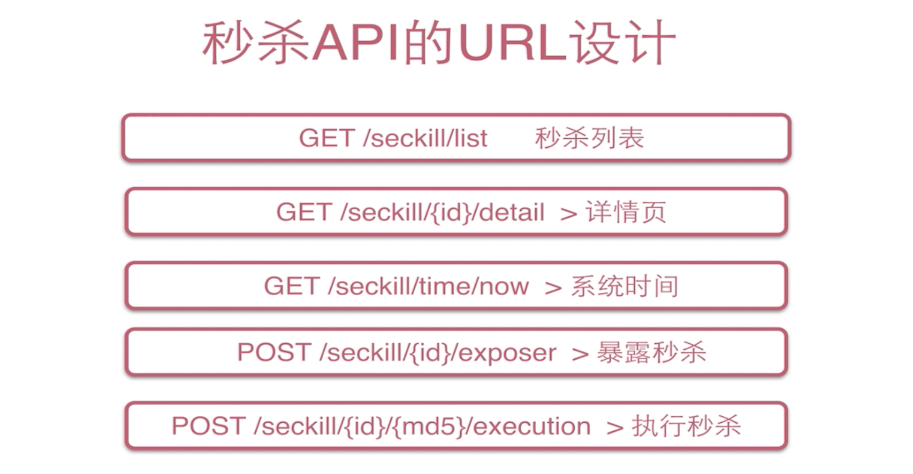
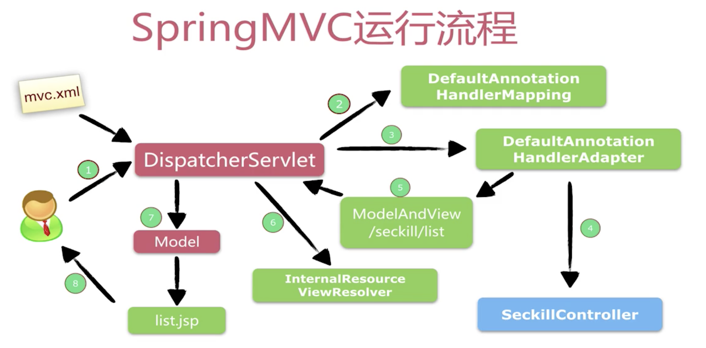
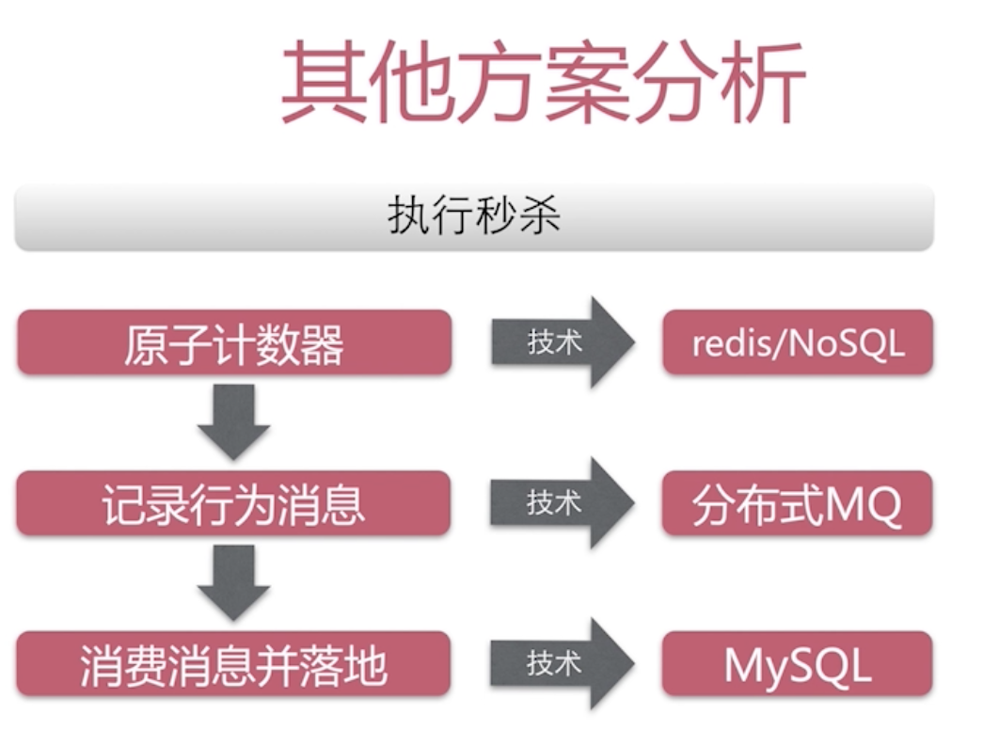
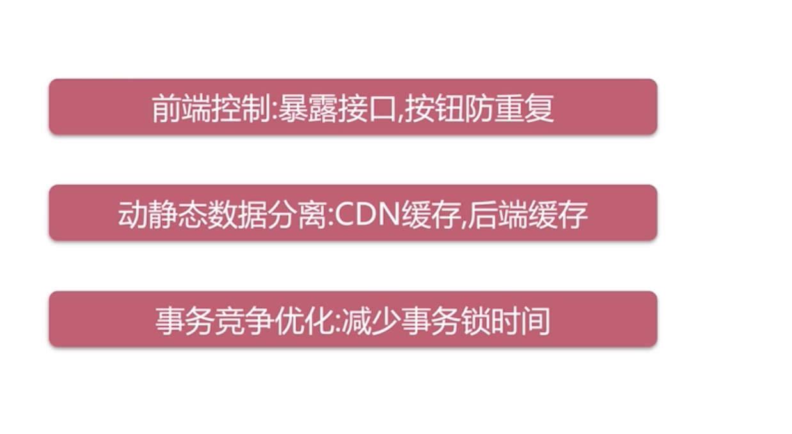

# seckill
SSM(spring+spring_mybatis)实现高并发秒杀系统，包含详细笔记


## 1、整体业务分析

1）展示商品所有列表；



2）点击链接进入商品详情页；

## 


## 2、DAO层设计与开发

### 2.1 Mysql&&NoSQL

​		关系型数据库(Mysql/Oracle/SqlServer等)和非关系型数据库(HBase/redis/mongoDB/Neo4j等)。

​		关系型和非关系型数据库的主要差异是数据存储的方式，关系型数据天然就是表格式的，非关系型数据是基于键值对的，通常存储在数据集中，就像文档、键值对或者图结构，所有非关系型数据存储天然就是分布式的，其真正的价值在操作的扩展性和大数据量处理。

​		SQL数据库支持对事务原子性细粒度控制，并且易于回滚事务，其在事务性操作上性能和稳定性比NoSQL好很多。并且目前事务机制是目前最可靠的落地方案。

### 2.2 Mysql实现秒杀业务的难点

​		当多个用户同时参与到秒杀活动时，会出现“竞争”，对于Mysql来说难点在于"事务+行级锁"

​		`start transaction`

​        `update 库存数量`**(出现竞争，行级锁：一条事务执行，其余事务全部在等待，直到commit)**

​		`insert 购买明细`

​        `Commit`

​		*<u>该问题在高并发部分解决！</u>*

### 2.3 数据库设计

​		将DDL(数据库定义语言)卸载了“/sql/sechema.sql”文件中，再对数据库进行操作。

​		建立一个seckill数据库，2张表：seckill、success_killed

### 2.4 Mybatis实现DAO理论

​		Mybatis主要特点在于：参数 + SQL = Entity/List 

​		Mybatis在哪些SQL：XML提供SQL

​		Mybaits如何实现接口: Mapper自动实现DAO接口, 通过Dao找Mapper文件下的同名的SQL语句，一个Dao对												应一个Mapper

### 2.5 Mybatis整合Spring理论

​		整合目标：更少的编码(只写接口不写实现类)；

​							更少的配置(1、使用别名，通过org.seckill.entity包扫描将 org.seckill.entity.Seckill—>Seckill

​												2、配置扫描，扫描sql配置文件：mapper需要的xml文件 

​												3、dao的实现，自动实现dao接口，自动注入spring容器)；

​							足够的灵活性(可以自己定义SQL语句、可以自由的通过表达式传递参数，最终实现结果集自动赋													 值。)

### 2.6 DAO实体/接口设计以及基于Mybatis实现

​	（1）配置Mybatis全局属性"resources/mybatis-config.xml"。

​	（2）**将数据库中的表——>Java中entity实体(org.seckill.entity)，将表中的列与实体类中的属性一一对应**

​		如果业务逻辑中出现**多对一**的情况，需要在多方的实体类中定义一方的实体类。在秒杀系统中多个成功秒杀的实体对应的是同一个秒杀对象实体，所在在SuccessKilled类中定义Seckill实体类：private Seckill seckill。

​    （3）实体类对应的接口设计，常用的是实体下的增删改查操作。(**org.seckill.dao**)

​	（4）为DAO接口的方法提供SQL语句："resources/mapper/*.xml"，namespace对应文件路径，id对应方法名，resultType对应返回值类型，parameterType对应参数类型，当出现多个参数的时候，接口方法中需要对参数进行注解，比如（@Param("seckillId") long seckillId, @Param("killTime")Date killTime）。

​	（5）Spring整合Mybatis，相关文件“resources/jdbc.properties”和“resources/spring/spring-dao”

​			  配置数据库相关参数“resources/jdbc.properties”、 数据库池连接、**配置sqlSessionFactory对象**、配置扫描Dao接口包，动态实现Dao接口，注入到spring容器中


## 3、Service层开发

### 3.1 秒杀Service接口设计

​	（1）业务接口要站在使用者的角度设置接口。

​		从三个方面入手：方法定义的粒度(从用户操作的角度入手，一般每个button都会对应一个方法)、参数(越简练越好)、返回类型(return 类型/异常)。

 	（2）service需要的package

​		service包：用来存放service接口及其实现类"./service/Impl/SeckillServiceImpl"；

​		exception包：存放service接口所需要的一些异常，比如重复秒杀、秒杀结束、内部错误等；

​		dto包：数据传输包 ，存放一个service和web之前的数据传递。		

### 3.2 Spring IOC整合Service

​		Spring会通过对象工厂和依赖管理实现一个一致性的访问接口。

​		IOC的优点：对象创建统一托管、规范的生命周期管理、灵活的依赖注入、一致的获取对象(从容器中一致获取) 。

​		Spring IOC 的注入方式：XML(用bean来实现第三方类库，如DataSource, 需要命名空间配置，如context、aop、mvc等)，注解(项目中自身开发使用的类，可以在代码中使用注解，如@Service @Controller等)、java配置类(自定义修改类库，不建议)。

​		本项目中IOC使用：XML配置——>package-scan包扫描(**扫描service包下所有使用注解的类型，这些类由Spring统一托管，不需要新建而是自动加载对象的实例到Spring 容器中**)——>Annotation注解(默认使用注解来管理事务行为)


### 

### 3.3  声明式事务运用

​		对事务的处理交由Spring进行统一的管理，当你的业务方法不发生异常（或者发生异常，但该异常也被配置信息允许提交事务）时，Spring就会让事务管理器提交事务，而发生异常（并且该异常不被你的配置信息所允许提交事务）时，则让事务管理器回滚事务。

​		注意try..catch..中的异常，Spring 可能感知不到。

​		采用注解的方式实现声明式事务@Transactional

```
使用注解控制事务方法的优点：
 1、开发团队达成一直约定，约定明确标注事务方法的编程风格。
 2、保证事务方法的执行时间尽可能短，不要穿插其他的网络操作（RPC/HTTP请求），或者剥离/封装到方法外面。
 3、不是所有的方法都需要事务，如只有一条修改操作、只读操作。
```


## 4、Web层开发

### 4.1 Restful接口设计与使用

​		一种优雅的URI表达方式、能表示资源的状态(名词)和状态的转移。

​		GET用于查询操作，POST用于添加和修改操作，PUT用于修改操作，DELETE用于删除操作

​        URL设计：/模块/资源/{标志}/集合1/...   如：/user/{uid}/friends 好友列表



​		

### 4.2 Spring MVC 框架运作流程

#### 4.2.1 Spring MVC理论



返回一个页面

```java
@RequestMapping(value = "/{seckillId}/detail", method = RequestMethod.GET)
public String detail(@PathVariable("seckillId") Long seckillId, Model model) {
    if (null == seckillId) {
        return "redirect:/seckill/list";
    }
    Seckill seckill = seckillService.getById(seckillId);
    if (null == seckill) {
        return "forward:/seckill/list";
    }
    model.addAttribute("seckill", seckill);//承载最终要返回给用户的数据，返回Seckill类数据
    return "detail";//view，在spring-web1里面配置

}
```

返回一个json(**现在大部分开发使用的方法**)

```java
@RequestMapping(value = "/{seckillId}/exposer",
        method = {RequestMethod.POST,RequestMethod.GET},
        produces = {"application/json;charset=utf-8"})
@ResponseBody //最后数据会封装成一个json，返回json数据
public SeckillResult<Exposer> exposer (Long seckillId){
    SeckillResult<Exposer> result;
    try {

        Exposer exposer = seckillService.exportSeckillUrl(seckillId);
        result = new SeckillResult<Exposer>(true,exposer);

    } catch (Exception e) {
        logger.error(e.getMessage(),e);
        result = new SeckillResult<Exposer>(false,e.getMessage());
    }
    return result;
}
```

cookie访问

```java
@RequestMapping(value = "/{seckillId}/{md5}/execution",
        method = {RequestMethod.POST,RequestMethod.GET},
        produces = {"application/json;charset=utf-8"})
@ResponseBody
public SeckillResult<SeckillExcution> excute(@PathVariable("seckillId") Long seckillId,
                                              @PathVariable("md5") String md5,
                                              @CookieValue(value = "killPhone" ,required = false) Long phone )
//killPhone会放入cookie中
{
  return null
}
```

#### 4.2.2 Spring MVC的配置

（1）配置DispatcherServlet，文件在WEB-INF/web.xml

1、配置DispatcherServlet

2、配置springMVC需要加载的配置文件spring-*.xml,  Mybatis->spring->springMVC

3、<servlet-mapping>默认匹配所有的请求 <url-pattern>/</url-pattern>

（2）配置Spring MVC

1、开启springMVC注解模式，

  1)、自动注册DefaultAnnotationHandlerMapping，AnnotationMethodHandlerAdapter
  2)、提供一系列的功能：数字和日期的format @NumberFormat @DateTimeFormat ，XML和JSON的数据支持

2、静态资源默认servlet配置

  1)、加入对静态资源的处理: js、gif、png
  2)、允许使用"/"作为整体映射

3、配置jsp 显示ViewResolver

4、扫描web相关的bean

### 4.3 Controller开发

与前端进行交互，返回一个界面或者json给前端，现在公司多都会使用返回json给前端。

一般使用一个统一的数据返回格式，在本项目中采用org.seckill.dto.SeckillResult

### 4.4 前端设计

使用bootstrap+jquery这里不多赘述

包括jQuery的一些插件：jQuery cookie插件、jQuery countDown倒计时插件

## 5、高并发

### 5.1高并发点和高并发分析

 	（1）高并发主要发生在：查看详情页、获取系统时间(不需要优化)、查看暴露接口、执行秒杀操作。

​	 （2）CDN是一个内容分发网络，用于加速用户获取数据，部署在离用户最近的节点上，不需要去访问互联网服务器，一般针对的是内容不变化的界面，导致**获取秒杀接口**不可以使用CDN，因为它会随着时间推移而改变，比如获取到接口执行秒杀等等，这种操作就适合用***后端的缓存redis缓存***。

```
 get from cache
 if null
   get db
   put cache
   locgoin

```

  （3）

分析：
    NoSQL , MQ等运维成本和稳定性不高；
    开发成本：数据一致性、回滚方案等需要手动实现；
    幂等性难保证：重复秒杀问题；
    不适合新手的架构。

（4）为什么不用Mysql解决？

​		当java控制事务进行事务行为时会有行级锁

​        1)update减库存：网络延迟问题和GC操作
​		2)insert购买明细：网络延迟问题和GC操作
​		3)commit/rollback

​      ***优化方向：减少行级锁的持有时间***

（5）优化总结




### 5.2优化思路并实现

#### 5.2.1redis后端缓存优化

​		redis实现秒杀接口暴露优化：

​		1）在pom.xml 文件中添加依赖:redis客户端 Jedis，protostuff序列化依赖；

​		2）创建RedisDao实现redis存取方法，具体实现：org.seckill.dao.cache.RedisDao

​		3）优化在SeckillService中exportSeckillUrl方法：

```java
//1、访问redis
Seckill seckill = redisDao.getSeckill(seckillId);
if (seckill == null){
    //2访问数据库
     seckill = seckillDao.queryById(seckillId);
    if (null==seckill){
        return new Exposer(false,seckillId);
    }else{
        //放入redis
        redisDao.putSeckill(seckill);
    }

}
```

#### 5.2.2 秒杀操作优化

​	（1）如何判断update更新库存成功：

​		条件：update自身没报错、客户端确认update影响行数

​		优化思路：把客户端逻辑放在MySql 服务器端，避免网络延迟和GC 

​        两种解决方案：定制SQL方案，修改SQL源码，update /* + [auto commit] */

​									***使用存储过程整个操作在Mysql端完成.   resources/sql/seckill.sql

​	（2）mybatis+spring实现存储过程操作

​			 1）在SeckillDao接口中添加一个方法 void killByProcedure(Map<String,Object> paramMap);

​			 2)   在对应的Mapper SeckillDao.xml文件中添加；			

```xml
<!--    使用mybatis调用存储过程-->
    <select id="killByProcedure" statementType="CALLABLE">
        call execute_seckill(
        #{seckillId,jdbcType=BIGINT,mode=IN},
        #{phone,jdbcType=BIGINT,mode=IN},
        #{killTime,jdbcType=TIMESTAMP,mode=IN},
        #{result,jdbcType=INTEGER,mode=OUT}
        );
    </select>
```

​		   3）实现service层和controller层编码

 


